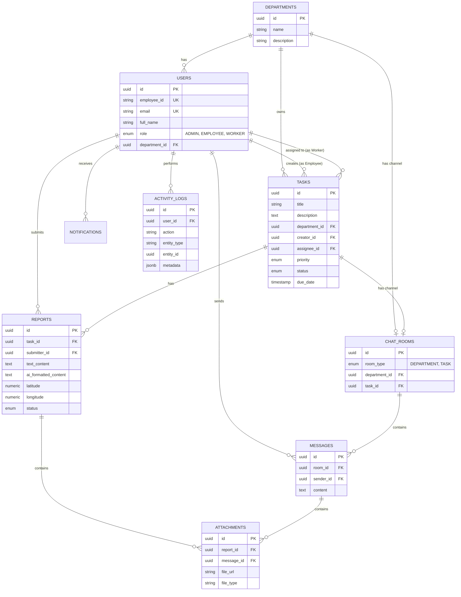

# JSW WorkFlow Pro Database Schema & Architecture

## 1. Entity-Relationship (ER) Diagram

## 2. Table Modules

1. **Users & Departments**: Core organizational structure. Tied to `auth.users` securely via the `id` matching the Supabase Auth UUID.
2. **Tasks & Reports**: Core operational logic. Reports can contain AI-generated content (from Gemini).
3. **Chat Rooms & Messages**: A unified chat architecture. A `chat_rooms` table abstracts whether a conversation belongs to a Department or a specific Task, simplifying message routing and RLS.
4. **Attachments**: Centralized blob storage metadata, allowing images/voice notes to attach to Reports or Chat Messages.
5. **Activity Logs & Notifications**: Observability and asynchronous alerting.

## 3. RLS Concepts

- **Admin Policy**: `TRUE` across the board generally, or explicitly defined to allow full CRUD.
- **Employee Policy**: 
  - `Tasks`: Select/Insert/Update where `task.department_id = auth_user.department_id`.
  - `Users`: Can view peers in the same department.
- **Worker Policy**:
  - `Tasks`: Select/Update where `task.assignee_id = auth.uid()`.
  - `Reports`: Insert where they are the assignee of the task. Read their own.
